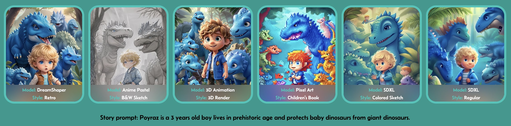

# About StoryChain

Welcome to StoryChain, a pioneering decentralized application (dApp) that is transforming the landscape of collaborative storytelling by integrating the power of blockchain technology and artificial intelligence (AI). StoryChain offers a unique platform where creativity knows no bounds, enabling users to collectively create engaging narratives, each immortalized as a non-fungible token (NFT) on the blockchain. With a focus on fostering creativity and participation, StoryChain stands at the forefront of a new era in digital storytelling.

<figure><figcaption></figcaption></figure>

You can choose your art style when starting a story. Your character can be realist, black & white, pixel art, 3D or many other styles you can choose among.

<figure><figcaption></figcaption></figure>

