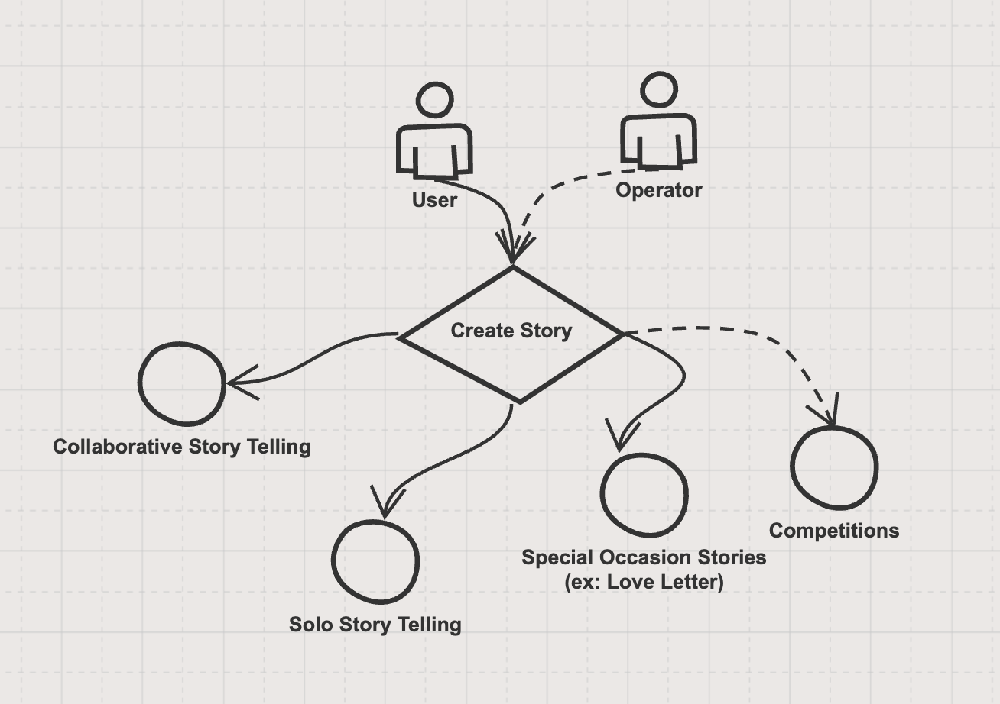
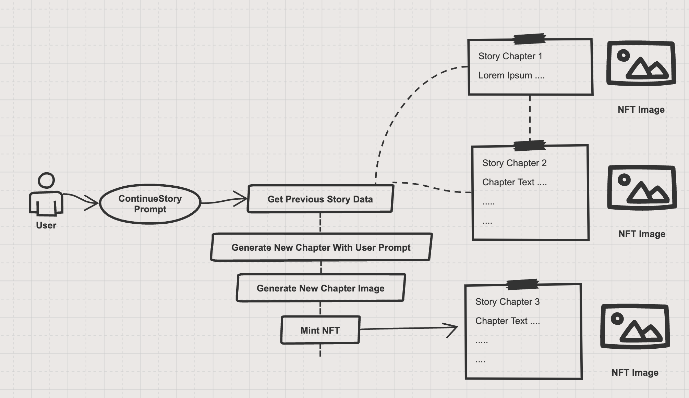

# Story Types

There are multiple types of content creation on StoryChain. I will give some examples on them but the story types will be enriched in the future. Different types will be enabled on different occasions.

<figure><figcaption></figcaption></figure>

* Collaborative Story Telling:

Users can create collobarative stories where one user continues with the previous chapters other users created.

<figure><figcaption></figcaption></figure>

* Solo Stories

Solo stories are generated with the user prompt and ends with the generation. It can not be continued by the user or by other users. This option is for users that wants their stories to be closed and does not want the story outcome to change.

