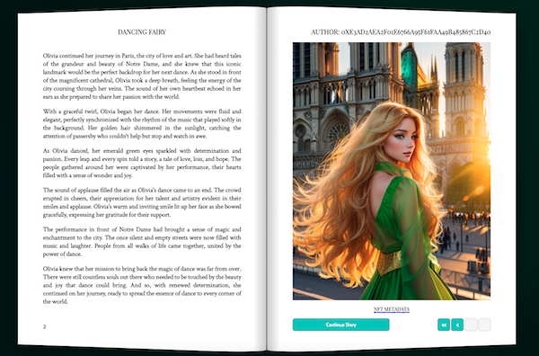

# How it Differs?

StoryChain's NFT system differs from other projects in two key aspects:

1\.     Personal Connection: Each NFT is a unique story with text and images based on the user's theme, fostering a deeper bond with the NFT.

<figure><figcaption></figcaption></figure>

2\.     [StoryChain Earn System](../other/earn-system.md): Provides dividend income to NFT holders from new NFT generation fees, promoting community growth and passive earning opportunities.
